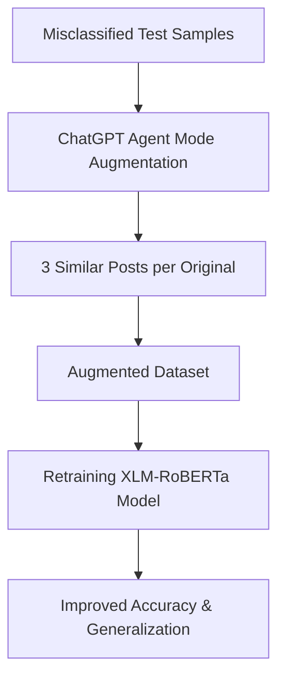

  
  <h1 align="center">  
      
     Improving Hate Speech Detection Using LLM-based Text Augmentation
  </h1>  

  <h3>Developed with the packages and tools below 🛠️</h3>  

  
  
      
      
      
      
      
      
      
      
      
  
  

    
    
    
    

# Dataset
### Before Filtering:

**Dataset Overview:**

| **Attribute**            | **Description**                                                                                                                                                                                                                                                                                                                                                                                                                                                                                                                             |
| ------------------------ | ------------------------------------------------------------------------------------------------------------------------------------------------------------------------------------------------------------------------------------------------------------------------------------------------------------------------------------------------------------------------------------------------------------------------------------------------------------------------------------------------------------------------------------------- |
| **Dataset Name**         | HateXplain                                                                                                                                                                                                                                                                                                                                                                                                                                                                                                                                  |
| **Source**               | [HateXplain – Hugging Face](https://huggingface.co/datasets/literAlbDev/hatexplain)                                                                                                                                                                                                                                                                                                                                                                                                                                                         |
| **Original Paper**       | Mathew, Binny, et al. *HateXplain: A Benchmark Dataset for Explainable Hate Speech Detection*. Proceedings of the AAAI Conference on Artificial Intelligence, 35(17), 14867–14875, 2021. [PDF](https://ojs.aaai.org/index.php/AAAI/article/view/17745)                                                                                                                                                                                                                                                                                      |
| **Language**             | English                                                                                                                                                                                                                                                                                                                                                                                                                                                                                                                                     |
| **Dataset Type**         | `datasets.DatasetDict` (Hugging Face format)                                                                                                                                                                                                                                                                                                                                                                                                                                                                                                |
| **Splits**               | **Train**: 15,383   **Validation**: 1,922   **Test**: 1,924                                                                                                                                                                                                                                                                                                                                                                                                                                                                           |
| **Features**             | `id` – Unique post identifier   `annotators` – Annotator labels and metadata   `rationales` – Token-level rationales from annotators   `post_tokens` – Tokenized post text                                                                                                                                                                                                                                                                                                                                                         |
| **Data Modality**        | Text (tokenized) + Annotator-provided explanations                                                                                                                                                                                                                                                                                                                                                                                                                                                                                          |
| **Cache File Locations** | Train: `/taher/ds/literAlbDev___hatexplain/.../hatexplain-train.arrow`   Validation: `/taher/ds/literAlbDev___hatexplain/.../hatexplain-validation.arrow`   Test: `/taher/ds/literAlbDev___hatexplain/.../hatexplain-test.arrow`                                                                                                                                                                                                                                                                                                      |
| **License**              | CC BY 4.0                                                                                                                                                                                                                                                                                                                                                                                                                                                                                                                                   |
| **Intended Use**         | Hate speech detection with explanation; model interpretability research                                                                                                                                                                                                                                                                                                                                                                                                                                                                     |
| **Example Record**       | **ID**: `23107796_gab`   **annotators**: `{"label": [0, 2, 2], "annotator_id": [203, 204, 233], "target": [["Hindu", "Islam"], ["Hindu", "Islam"], ["Hindu", "Islam", "Other"]]}`   **rationales**: Multiple lists indicating highlighted tokens   **post\_tokens**: `["u", "really", "think", "i", "would", "not", "have", "been", "raped", "by", "feral", "hindu", "or", "muslim", "back", "in", "india", "or", "bangladesh", "and", "a", "neo", "nazi", "would", "rape", "me", "as", "well", "just", "to", "see", "me", "cry"]` |

**Feature Summary:**

| **Feature**      | **Type**          | **Description**                                                                  | **Example Value**                                                                                                                        |
| ---------------- | ----------------- | -------------------------------------------------------------------------------- | ---------------------------------------------------------------------------------------------------------------------------------------- |
| **id**           | `string`          | Unique identifier for each post                                                  | `"23107796_gab"`                                                                                                                         |
| **annotators**   | `dict`            | Contains annotator labels, IDs, and target groups for hate speech classification | `{"label": [0, 2, 2], "annotator_id": [203, 204, 233], "target": [["Hindu", "Islam"], ["Hindu", "Islam"], ["Hindu", "Islam", "Other"]]}` |
| **rationales**   | `list[list[int]]` | Token-level binary masks (1 = token marked as rationale) provided by annotators  | `[[0, 0, 0, 0, 0, 0, 0, 0, 1, ...], [...]]`                                                                                              |
| **post\_tokens** | `list[string]`    | Tokenized post text                                                              | `["u", "really", "think", "i", "would", "not", "have", "been", "raped", "by", "feral", "hindu", "or", "muslim", ...]`                    |

### After Filtering

  **_Table 1: Filtered HateXplain Dataset Statistics_**
  
| **Split** | **Samples** | **Hatespeech (0)** | **Normal (1)** |
| --------- | ----------: | -----------------: | --------------: |
| **Train** |     10,999 |             4,748 |          6,251 |
| **Valid** |      1,376 |               594 |            782 |
| **Test**  |      1,374 |               781 |            593 |

  **_Table 2: 🏷 Label Mapping_**
  
| **Label ID** | **Meaning**                                     |
| ------------ | ----------------------------------------------- |
| **0**        | Hatespeech                                      |
| **1**        | Normal                                          |
| **2**        | Offensive *(excluded in this filtered dataset)* |

# Model
### Architecture (Lyerwise dimensions)

### 📏 Notation

- **B** = Batch size  
- **L** = Sequence length (≤ **512**; XLM-R max positions ≈ **514**)  
- **H** = Hidden size = **1024**  
- **A** = Attention heads = **16** (head dimension = 1024 / 16 = **64**)  
- **I** = Intermediate size = **4096**  
- **C** = Number of classes = **2**

| Stage                        | Operation                            | Input → Output shape                                |
| ---------------------------- | ------------------------------------ | --------------------------------------------------- |
| Tokenization                 | text → `input_ids`, `attention_mask` | —                                                   |
| Embeddings                   | lookup + positional                  | `[B, L] → [B, L, 1024]`                             |
| Encoder blk (per layer, ×24) | LayerNorm                            | `[B, L, 1024] → [B, L, 1024]`                       |
|                              | Q/K/VP (linear)                      | `[B, L, 1024] → [B, L, 1024]` (for each of Q, K, V) |
|                              | Reshape for heads                    | `[B, L, 1024] → [B, 16, L, 64]`                     |
|                              | Scaled dot-prod attention            | Q,K,V: `[B,16,L,64] → [B,16,L,64]`                  |
|                              | Concat heads                         | `[B,16,L,64] → [B, L, 1024]`                        |
|                              | Output proj (linear)                 | `[B, L, 1024] → [B, L, 1024]`                       |
|                              | Dropout + Residual                   | `[B, L, 1024] → [B, L, 1024]`                       |
|                              | LayerNorm                            | `[B, L, 1024] → [B, L, 1024]`                       |
|                              | FFN (gelu)                           | `[B, L, 1024] → [B, L, 4096] → [B, L, 1024]`        |
|                              | Dropout + Residual                   | `[B, L, 1024] → [B, L, 1024]`                       |
| Final hidden                 | last layer output                    | `[B, L, 1024]`                                      |
| Pooling                      | take `<s>` token (index 0)           | `[B, L, 1024] → [B, 1024]`                          |
| Classifier                   | Dropout                              | `[B, 1024] → [B, 1024]`                             |
|                              | Linear                               | `[B, 1024] → [B, 2]`                                |
|                              | Softmax (inference)                  | `[B, 2] → [B, 2]`                                   |

### ⚙️ Config Quick Facts – xlm-roberta-large

- **Layers:** 24 encoder blocks  
- **Hidden size:** 1024  
- **Attention heads:** 16 (head dimension = 64)  
- **FFN intermediate size:** 4096  
- **Vocabulary size:** ~250k (SentencePiece)  
- **Max positions:** 514  
- **Parameters:** ~550M (backbone + classification head)

# Results
### Before Augmentation:

  
    
  
 <i> Figure 1: Training and validation loss curves </i>

Figure 1, The training and validation loss curves indicate that the model initially learns effectively, with both losses decreasing from epoch 1 to epoch 2. However, starting from epoch 3, the training loss continues to drop steadily, while the validation loss begins to rise. This divergence suggests overfitting, where the model is becoming increasingly specialized to the training data at the expense of generalization to unseen data. The lowest validation loss is observed around epoch 2, implying that this would have been an optimal early stopping point to maximize performance and avoid overfitting in later epochs.

  
    
  
 <i> Figure 2: Validation accuracy curve </i>

Figure 2, The validation accuracy curve shows that the model maintains a consistently high performance across all epochs, staying around 88–89%. There is only a slight increase from epoch 1 to epoch 3, after which the accuracy stabilizes, with minimal fluctuations. This indicates that while additional training beyond epoch 3 does not significantly degrade validation accuracy, it also does not yield meaningful improvements. Combined with the validation loss trend, this suggests that the model reaches its optimal generalization capacity early in training, and further epochs mainly contribute to overfitting without boosting accuracy.

 

 <b> <i> Table 1: Classification report before augmentation </i></b>

  **_Table 3: Classification report before augmentation_**
  
| **Class / Metric** | **Precision** | **Recall** | **F1-score** | **Support** |
| ------------------ | ------------: | ---------: | -----------: | ----------: |
| **Normal**         |        0.8571 |     0.8600 |       0.8586 |         593 |
| **Hate**           |        0.8935 |     0.8912 |       0.8923 |         781 |
| **Accuracy**       |        0.8777 |     0.8777 |       0.8777 |           — |
| **Macro Avg**      |        0.8753 |     0.8756 |       0.8754 |        1374 |
| **Weighted Avg**   |        0.8778 |     0.8777 |       0.8778 |        1374 |

From Table 3 we can see that the model achieves an overall accuracy of 87.77%, showing strong performance in distinguishing between Hate and Normal posts.
For the Normal class, precision (85.71%) and recall (86.00%) are balanced, indicating that the model correctly identifies most normal posts while keeping false positives relatively low.
The Hate class achieves slightly higher precision (89.35%) and recall (89.12%), meaning the model is slightly better at detecting hate speech compared to normal posts.
The F1-scores for both classes (Normal: 85.86%, Hate: 89.23%) confirm balanced performance without significant trade-offs between precision and recall.
Macro average values (~87.54%) show that both classes are treated relatively equally, while weighted averages (~87.78%) reflect the class distribution without a significant performance drop due to imbalance.

  
  
  
 <i> Figure 3: Confusion matrix before augmentation </i>

The confusion matrix in Figure 3 shows that the model correctly classified 510 Normal posts and 696 Hate posts, demonstrating strong predictive ability for both categories.
Misclassifications are relatively balanced, with 83 Normal posts incorrectly labeled as Hate and 85 Hate posts incorrectly labeled as Normal, indicating no severe bias toward one class.
The high number of correct predictions for Hate posts (true positives) and Normal posts (true negatives) aligns with the strong precision and recall scores in the classification report.
Overall, the confusion matrix confirms that the model performs reliably in detecting hate speech while maintaining accuracy in identifying normal content.

  
  
  
 <i> Figure 4: ROC curve before augmentation </i>

The ROC curve in Figure 4 demonstrates that the model maintains a high true positive rate while keeping the false positive rate relatively low across varying classification thresholds.
The curve rises steeply towards the top-left corner, indicating strong discriminatory power between the Hate and Normal classes.
An AUC score of 0.94 confirms excellent performance, meaning there is a 94% probability that the model will rank a randomly chosen hate speech example higher than a randomly chosen normal post.
This high AUC suggests that the model is robust to threshold changes and is effective at balancing sensitivity (recall) and specificity.

### 🛠 Data Augmentation Strategy

To improve model generalization, we implemented an **error-driven augmentation** approach using ChatGPT’s Agent Mode.

1. **Identify Errors** – Misclassified samples from the test set were extracted.  
2. **Augmentation via ChatGPT Agent Mode** – For each misclassified post, three semantically similar versions were generated while preserving the original label. This ensured diversity without introducing label noise.  
3. **Dataset Expansion** – The augmented posts were appended to the training data, increasing representation for challenging examples.  
4. **Retraining** – The updated dataset was used to retrain the same architecture, resulting in significant performance gains (see Table X).  

This method targeted the model’s weak spots directly, leading to a **+9% absolute accuracy increase** and improved precision/recall for both classes.

---

#### 📊 Data Augmentation Flowchart

## After Augmentation

  
  
  
 <i> Figure 5: Training and validation loss curves </i>

Figure 5, the updated training and validation loss curves show that after augmenting the misclassified samples and retraining, the model achieves lower validation loss in the early epochs compared to before. Both training and validation loss decrease steadily up to epoch 3, indicating better generalization. While validation loss begins to rise slightly after epoch 3, the increase is more gradual than in the original training, suggesting that augmentation has reduced overfitting and improved the model’s ability to learn from challenging examples.

  
  
  
 <i> Figure 6: Validation accuracy curve after augmentation </i>

Figure 6, the validation accuracy curve after augmentation shows a clear improvement in early epochs, rising from around 84% in epoch 1 to nearly 89% by epoch 3. This indicates that adding augmented misclassified samples enhanced the model’s learning from the start, allowing it to generalize better to unseen data. While accuracy slightly dips after epoch 3, it remains consistently higher than the initial epoch values, suggesting that the augmentation strategy effectively strengthened the model’s robustness without causing significant overfitting.

  **_Table 4: Classification Report – After Augmentation_**
  
| **Class / Metric** | **Precision** | **Recall** | **F1-score** | **Support** |
| ------------------ | ------------: | ---------: | -----------: | ----------: |
| **Normal**         |        0.9363 |     0.9663 |       0.9510 |         593 |
| **Hate**           |        0.9738 |     0.9501 |       0.9618 |         781 |
| **Accuracy**       |        0.9571 |     0.9571 |       0.9571 |           — |
| **Macro Avg**      |        0.9550 |     0.9582 |       0.9564 |        1374 |
| **Weighted Avg**   |        0.9576 |     0.9571 |       0.9571 |        1374 |

From Table 4 we can see that after augmentation, the model’s accuracy increased from 87.77% to 95.71%, indicating a substantial improvement in predictive performance. Precision and recall both improved for Normal and Hate classes, with Normal recall jumping from ~86% to ~96% and Hate precision reaching ~97%. The balanced gains across both classes suggest that augmentation not only reduced false positives for the Hate class but also significantly improved the model’s ability to correctly identify Normal posts. This performance boost confirms that similar-sentence based data augmentation enhanced the model’s generalization and reduced prior misclassifications.

  
  
  
 <i> Figure 7: Confusion matrix after augmentation </i>

The updated confusion matrix after augmentation in Figur 7 shows a significant performance boost:

1. Normal class: Out of 593 actual Normal posts, the model correctly classified 573 and misclassified only 20 as Hate.

2. Hate class: Out of 781 actual Hate posts, 742 were correctly classified, with 39 misclassified as Normal.

Compared to the pre-augmentation results, both false positives and false negatives have dropped sharply. This demonstrates that the augmentation process has strengthened the model’s ability to correctly classify both categories, improving balance and reducing misclassification errors in both directions.

  
  
  
 <i> Figure 8: ROC curve after augmentation </i>

Figure 8, the ROC curve after augmentation shows a dramatic improvement, with the AUC reaching 0.99, indicating near-perfect separation between the Hate and Normal classes.
The curve rises almost vertically towards the top-left corner, meaning the model achieves a very high true positive rate while keeping the false positive rate close to zero across most thresholds.
This reflects a strong ability to correctly classify both classes with minimal errors, and confirms that the augmentation step greatly enhanced the model’s discriminative power.

  **_Table 5: Performance Improvement – Before vs. After Augmentation_**
  
| **Metric**           | **Before** | **After** | **% Improvement** |
| -------------------- | ---------: | --------: | ----------------: |
| **Normal Precision** |     0.8571 |    0.9363 |            +9.23% |
| **Normal Recall**    |     0.8600 |    0.9663 |           +12.35% |
| **Normal F1**        |     0.8586 |    0.9510 |           +10.77% |
| **Hate Precision**   |     0.8935 |    0.9738 |            +8.99% |
| **Hate Recall**      |     0.8912 |    0.9501 |            +6.61% |
| **Hate F1**          |     0.8923 |    0.9618 |            +7.78% |
| **Accuracy**         |     0.8777 |    0.9571 |            +9.06% |

### 📖 Interpretation

From Table 5, the results clearly demonstrate that **error-driven data augmentation** significantly improved the model’s performance:

- **Normal** class recall showed the largest gain (**+12.35%**), meaning the model is now much better at correctly identifying non-hate content.  
- **Hate** class precision improved by nearly **9%**, reducing false positives and improving reliability in hate speech detection.  
- **Overall accuracy** jumped from **87.77%** to **95.71%** (**+9.06%**), highlighting stronger generalization and reduced misclassification.  

This improvement confirms that augmenting misclassified samples is an effective strategy for boosting classification performance without altering the core architecture.

# References

[1] D. R. Beddiar, M. S. Jahan, and M. Oussalah, “Data expansion using back
translation and paraphrasing for hate speech detection,” Online Social
Networks and Media, vol. 24, p. 100153, 2021.

[2] B. Mathew, P. Saha, S. M. Yimam, C. Biemann, P. Goyal, and A. Mukherjee, “Hatexplain: A benchmark dataset for explainable hate speech detection,” in Proceedings of the AAAI Conference on Artificial Intelligence,
vol. 35, no. 17, 2021, pp. 14 867–14 875.

[3] “literAlbDev/hatexplain · Datasets at Hugging Face — huggingface.co,”
https://huggingface.co/datasets/literAlbDev/hatexplain, [Accessed 11-082025].

[4] A. Conneau, K. Khandelwal, N. Goyal, V. Chaudhary,
G. Wenzek, F. Guzm ́an, E. Grave, M. Ott, L. Zettlemoyer, and
V. Stoyanov, “Unsupervised cross-lingual representation learning
at scale,” CoRR, vol. abs/1911.02116, 2019. [Online]. Available:
http://arxiv.org/abs/1911.02116

